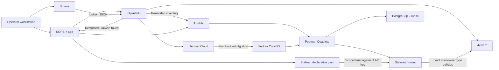

# Architecture

## Goals

The repository builds a reusable, security-focused Fedora CoreOS VPS fleet with
explicit ownership and reproducible configuration. The current production
shape assigns one x86_64 Hetzner CX23 the Stalwart and PostgreSQL mail role,
while additional nodes can use the same host baseline without becoming mail
servers.

The design favors:

- immutable host configuration over imperative server customization;
- narrowly scoped credentials over shared provider tokens;
- declarative service units over ad-hoc container commands;
- encrypted, process-scoped secret delivery over plaintext files;
- a small public network surface over feature-complete port exposure;
- defense in depth over maximum database or network throughput.

High availability, multi-region replication, outbound mail reputation
management, application-level backup automation, and full Stalwart policy
configuration are outside the current repository scope.

## System Overview

## Component Ownership

| Component | Owns | Does not own |
| --- | --- | --- |
| `Butane/` | Mail-independent first-boot user, SSH policy, kernel and sysctl hardening, masked services, gVisor installation | Cloud resources, host roles, or application configuration |
| `OpenTofu/` | Hetzner servers, shared base firewall, role firewall, placement, backups, protection, per-node reverse DNS, apex-deny and mail-specific CAA, selected shared deSEC RRsets, A/AAAA records, exact-name Stalwart token | Zone lifecycle and authorized mail-domain record contents managed natively by Stalwart |
| `SOPS/` | Encrypted provider and application credentials, age recipient policy, secret handoff helpers | Infrastructure state or persistent application data |
| `Ansible/` | Group-scoped Podman secrets, Quadlet source files, support files, networks, volumes, and service reconciliation | Host boot configuration or cloud lifecycle |
| `Stalwart/` | Exact TLS listeners, verified local Web UI Application, HTTP security headers and CSP, HTTP rate limits, and SMTP authentication policy | Domains, accounts, certificates, DNS publication, or mail routing policy |
| Stalwart | Mail service configuration and explicitly authorized DNS owner/type pairs | Zone lifecycle, CAA/HTTPS records, unrelated names, address records, reverse DNS, TLSA, or token management |
| PostgreSQL | Stalwart relational data | Host networking or external database access |

## Provisioning Lifecycle

1. `Scripts/upload-fcos-image.sh` runs exact tag-and-digest pins for
   coreos-installer and hcloud-upload-image, downloads the selected FCOS
   Hetzner image, and creates a labeled snapshot. OpenTofu selects the newest
   matching snapshot unless an explicit image ID is supplied.
2. `Scripts/render-ignition.sh` stages the operator's SSH public key and gVisor
   installer, compiles `Butane/fcos.bu` in strict mode, and rejects output over
   Hetzner's 32 KiB user-data limit.
3. OpenTofu sends the Ignition JSON directly as `hcloud_server.user_data`.
   There is no cloud-init translation or second bootstrap path.
4. On first boot, Ignition creates the operator account, applies the same host
   policy to every node, configures strict Cloudflare DNS-over-TLS, and enables
   `gvisor-install.service`. That generic unit downloads one immutable gVisor
   release bundle, verifies its SHA-512 digest, and installs `runsc` with its
   required sidecars. It has no mail-unit ordering dependency; Quadlets declare
   their own requirement on it.
5. OpenTofu reads the existing deSEC zone, reconciles per-node host records,
   aligns each Hetzner PTR record with its declared hostname, and mints
   Stalwart's restricted child token for the selected mail node.
6. `make apply` writes that generated token directly from OpenTofu output into
   the encrypted mail secret scope without a plaintext temporary file.
7. `Scripts/render-inventory.sh` converts the OpenTofu inventory output into an
   ignored, owner-readable Ansible inventory. Every VPS belongs to `fcos`; only
   the selected node belongs to `mail`.
8. The current Ansible play targets `mail` only. It verifies the pinned Web UI
   checksum, mounts that bundle read-only, sends Podman secret bytes through
   SSH standard input, reconciles Quadlet sources atomically, and restarts only
   changed services. FCOS needs no Python interpreter.
9. After certificate bootstrap, the pinned Stalwart CLI reconciles the
   committed hardening plan through a least-privilege SOPS-backed API key. It
   skips the mutation when the managed live fields already match and audits
   configuration, HTTPS headers, and implicit-TLS handshakes afterwards.

Ignition is a first-boot mechanism. Changes under `Butane/` do not reconcile an
already installed host; rebuild the server when those files change.

## Runtime Layout

| Service | Host exposure | Persistent state | Runtime |
| --- | --- | --- | --- |
| PostgreSQL | None; private `mail` network only | `mail-postgres-data` named volume | gVisor `runsc` |
| Stalwart SMTP | TCP 25 | PostgreSQL and `mail-stalwart-data` | gVisor `runsc` |
| Stalwart HTTPS/JMAP/admin | TCP 443 | PostgreSQL and `mail-stalwart-data` | gVisor `runsc` |
| Stalwart submission | TCP 465, implicit TLS | PostgreSQL and `mail-stalwart-data` | gVisor `runsc` |
| Stalwart IMAP | TCP 993, implicit TLS | PostgreSQL and `mail-stalwart-data` | gVisor `runsc` |
| Stalwart bootstrap HTTP | Temporary `127.0.0.1:8080` opt-in only | PostgreSQL and `mail-stalwart-data` | gVisor `runsc` |

Both containers have read-only root filesystems and explicit writable volumes
or tmpfs mounts. Stalwart's storage configuration references the PostgreSQL
password by environment-variable name, and the restricted deSEC token is
available for the later Stalwart DNS configuration. PostgreSQL receives its
password through a mounted Podman secret.

## DNS Authority

deSEC is mandatory. The zone already exists and is read rather than created by
OpenTofu. The bootstrap `DESEC_API_TOKEN` must read the zone, manage the host
A/AAAA records, and manage child tokens. It is never passed to Stalwart.

OpenTofu creates a child token with:

- a default-deny policy;
- write access only to the exact reviewed mail owner-name/type pairs;
- DKIM access only for selectors declared in `stalwart_dkim_selectors`;
- no wildcard, unrelated-name, CAA, A/AAAA, or TLSA permission;
- authentication restricted to the mail server's public IPv4 and IPv6
  addresses;
- no domain creation, domain deletion, or token-management permission.

OpenTofu keeps ownership of A, AAAA, Hetzner PTR, strict CAA, and selected
non-mail records so Stalwart cannot redirect the host identity, weaken
certificate policy, or expand its own authority. The exact ownership split is
recorded in [DNS Ownership](DNS.md).

## State and Data

| State | Location | Protection |
| --- | --- | --- |
| Provider credentials | `SOPS/infrastructure.sops.yaml` | SOPS-encrypted to committed age recipients |
| Mail credentials | `SOPS/mail.sops.yaml` | SOPS-encrypted to committed age recipients |
| Stalwart hardening API key | `SOPS/mail.sops.yaml` | Replace-mode permissions limited to the four managed object types; supplied only to the local CLI process |
| deSEC child token | OpenTofu state and encrypted mail scope | Sensitive output plus SOPS encryption; state itself must be protected separately |
| OpenTofu state | Local by default | Ignored by Git; use an encrypted, access-controlled remote backend for shared automation |
| Generated inventory and host keys | `Ansible/inventory/` | Ignored by Git; inventory mode is `0600` |
| Podman secret hashes | `/var/lib/quadlet-secrets` | Root-only; contains hashes, not plaintext values |
| Application data | Rootful Podman named volumes | Protected by host access controls and Hetzner backup policy |

The age private identity is workstation authority. It is never committed and
must be backed up securely outside this repository.

## Architecture Constraints

The active host configuration is x86_64-specific: the gVisor release URL and
several kernel arguments target the CX23 architecture. OpenTofu and the image
uploader expose ARM options for infrastructure selection, but switching the
production host to ARM also requires an intentional Butane and gVisor review.

gVisor reduces the host-kernel attack surface but does not remove trust in the
FCOS host, Podman, the container images, or an operator with root access. Each
sandbox also introduces I/O and networking overhead, which is especially
relevant to PostgreSQL and a mail server.
