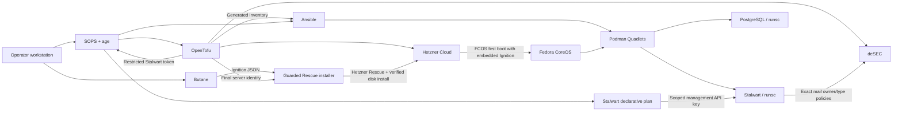

# Architecture

## Goals

The repository builds a reusable, security-focused Fedora CoreOS VPS fleet with
explicit ownership and reproducible configuration. The current production
shape assigns one x86_64 Hetzner CX23 the Stalwart and PostgreSQL mail role,
while additional nodes can use the same host baseline without becoming mail
servers.

The design favors:

- immutable host configuration over imperative server customization;
- narrowly scoped credentials over shared provider tokens;
- declarative service units over ad-hoc container commands;
- encrypted, process-scoped secret delivery over plaintext files;
- a small public network surface over feature-complete port exposure;
- defense in depth over maximum database or network throughput.

High availability, multi-region replication, outbound mail reputation
management, application-level backup automation, and full Stalwart policy
configuration are outside the current repository scope.

## System Overview

## Component Ownership

| Component | Owns | Does not own |
| --- | --- | --- |
| `Butane/` | Mail-independent first-boot user, SSH policy, kernel and sysctl hardening, masked services, gVisor installation | Cloud resources, host roles, or application configuration |
| `OpenTofu/` | Hetzner servers, shared base firewall, role firewall, placement, backups, protection, per-node reverse DNS, selected shared deSEC RRsets, A/AAAA records, CAA, DMARC, TLS-RPT, and the exact-name Stalwart token | Zone lifecycle and authorized mail-domain record contents managed natively by Stalwart |
| `Scripts/install-fcos*.sh` | Guarded Rescue activation, hash-checked installer transport, direct FCOS disk installation, and installation-state transition | Cloud resource declaration, application secrets, or running-host reconciliation |
| `SOPS/` | Encrypted provider and application credentials, age recipient policy, secret handoff helpers | Infrastructure state or persistent application data |
| `Ansible/` | Group-scoped Podman secrets, Quadlet source files, support files, networks, volumes, and service reconciliation | Host boot configuration or cloud lifecycle |
| `Stalwart/` | Declarative server identity, Domain, deSEC and staged ACME bootstrap, exact TLS listeners, verified local Web UI Application, password policy, protocol and queue resource limits, HTTP security headers and CSP, and SMTP authentication policy | Accounts, mailbox data, or unrelated DNS records |
| Stalwart | Mail service configuration and explicitly authorized DNS owner/type pairs, including inbound SMTP TLSA | Zone lifecycle, CAA, DMARC, TLS-RPT, HTTPS records, unrelated names, address records, reverse DNS, or token management |
| PostgreSQL | Stalwart relational data | Host networking or external database access |

## Provisioning Lifecycle

1. OpenTofu creates the final x86_64 server from a native bootstrap image,
   attaches the operator SSH key and firewalls, and records a guarded
   `fcos-installation=pending` marker. The native filesystem is disposable.
2. `Scripts/render-ignition.sh` stages the operator's SSH public key and gVisor
   installer and compiles `Butane/fcos.bu` in strict mode.
3. `Scripts/install-fcos.sh` extracts coreos-installer plus its exact runtime
   libraries from the immutable tool image, boots the final server into
   Hetzner Rescue, transfers hash-checked installation inputs, and invokes the
   bundled loader. The remote guard requires an expected unmounted block
   device. CoreOS Installer downloads and verifies FCOS, writes it directly to
   the server disk, embeds Ignition, sets the Hetzner platform ID, and enables
   initramfs DHCP so Afterburn can reach Hetzner's link-local metadata service.
   No temporary server, snapshot, or cloud-init path exists.
4. The controller power-cycles the server, verifies an FCOS ostree boot over
   SSH, and changes only the ignored installation marker to `installed`.
   Repeated runs skip it; a destructive reinstall requires an explicit
   override. Hetzner continues to report the creation-time native image as
   server metadata even though the local disk now contains FCOS; the
   `servers.bootstrap_image` output names that distinction explicitly.
5. On first boot, Ignition creates the operator account, applies the same host
   policy to every node, configures strict Cloudflare DNS-over-TLS, links every
   host resolver client to systemd-resolved's locally validating stub, and
   enables `gvisor-install.service`. That generic unit downloads one immutable
   gVisor release bundle, verifies its SHA-512 digest, and installs `runsc` with
   its required sidecars. It has no mail-unit ordering dependency; Quadlets
   declare their own requirement on it.
6. OpenTofu reads the existing deSEC zone, reconciles per-node host records,
   aligns each Hetzner PTR record with its declared hostname, and mints
   Stalwart's restricted child token for the selected mail node.
7. `make apply` writes that generated token directly from OpenTofu output into
   the encrypted mail secret scope without a plaintext temporary file.
8. `Scripts/render-inventory.sh` converts the OpenTofu inventory output into an
   ignored, owner-readable Ansible inventory. Every VPS belongs to `fcos`; only
   the selected node belongs to `mail`. Each `ansible_host` is the
   deSEC-managed node FQDN rather than one address, allowing OpenSSH to use its
   A and AAAA records without changing inventory or host-key identity.
9. The current Ansible play targets `mail` only. It verifies the pinned Web UI
   checksum, mounts that bundle read-only, sends Podman secret bytes through
   SSH standard input, reconciles Quadlet sources atomically, and restarts only
   changed services. Each Stalwart container receives the stable, unique
   Ansible inventory name as `STALWART_HOSTNAME`, preventing container IDs from
   becoming new cluster-node leases after restarts. FCOS needs no Python
   interpreter.
10. `make stalwart-bootstrap` creates a fresh one-run recovery credential,
    carries it through transient local and server-side Podman secrets, and
    temporarily enables the loopback listener and SSH tunnel. It applies the
    committed identity, deSEC, Domain, DKIM, local Web UI, and
    production ACME declaration and the first-rollout-only staging declaration;
    discovers the exact DKIM selectors and active ACME account URI; and expands
    only the required child-token
    policies. After public trust, apex/mail CAA, and a regular Web UI
    administrator have been verified, the exit trap restores the production
    Quadlet before deleting the recovery secret.
11. The pinned Stalwart CLI reconciles the committed hardening plan through a
    least-privilege SOPS-backed API key. It skips the mutation when the managed
    live fields already match and audits configuration, HTTPS headers, DAV
    routes, the TLS 1.3 client floor, and SMTP federation TLS 1.2 compatibility
    afterwards.

Ignition is a first-boot mechanism. Changes under `Butane/` do not reconcile an
already installed host; rebuild the server when those files change.

## Runtime Layout

| Service | Host exposure | Persistent state | Runtime |
| --- | --- | --- | --- |
| PostgreSQL | None; private `mail` network only | `mail-postgres-data` named volume | gVisor `runsc` |
| Stalwart SMTP federation | TCP 25, mandatory STARTTLS 1.2/1.3 | PostgreSQL and `mail-stalwart-data` | gVisor `runsc` |
| Stalwart HTTPS/JMAP/CalDAV/CardDAV/WebDAV/admin | TCP 443, TLS 1.3 | PostgreSQL and `mail-stalwart-data` | gVisor `runsc` |
| Stalwart submission | TCP 465, implicit TLS 1.3 | PostgreSQL and `mail-stalwart-data` | gVisor `runsc` |
| Stalwart IMAP | TCP 993, implicit TLS 1.3 | PostgreSQL and `mail-stalwart-data` | gVisor `runsc` |
| Stalwart bootstrap HTTP | Temporary `127.0.0.1:8080` opt-in only | PostgreSQL and `mail-stalwart-data` | gVisor `runsc` |

Both containers have read-only root filesystems and explicit writable volumes
or tmpfs mounts. Stalwart's storage configuration references the PostgreSQL
password by environment-variable name, and the restricted deSEC token is
available for the later Stalwart DNS configuration. PostgreSQL receives its
password through a mounted Podman secret. Both containers have runtime health
checks; Stalwart's liveness probe causes systemd to restart an unresponsive
service after three consecutive failures.

## DNS Authority

deSEC is mandatory. The zone already exists and is read rather than created by
OpenTofu. The bootstrap `DESEC_API_TOKEN` must read the zone, manage the host
A/AAAA records, and manage child tokens. It is never passed to Stalwart.

OpenTofu creates a child token with:

- a default-deny policy;
- write access only to the exact reviewed mail owner-name/type pairs;
- DKIM access only for exact selectors supplied by the ignored generated
  `stalwart_dkim_selectors` override;
- no wildcard, unrelated-name, or A/AAAA permission; TLSA access is limited to
  the five exact public TLS listener names, and there is no CAA, DMARC, or
  TLS-RPT access;
- authentication restricted to the mail server's public IPv4 and IPv6
  addresses;
- no domain creation, domain deletion, or token-management permission.

OpenTofu keeps ownership of A, AAAA, Hetzner PTR, selected non-mail records,
both CAA RRsets, DMARC, and TLS-RPT so Stalwart cannot redirect the host
identity, combine report destinations, or expand its own authority. The
bootstrap reads Stalwart's registered account URI and feeds
that public value into the ignored generated OpenTofu input. The exact
ownership split is recorded in [DNS Ownership](DNS.md).

## State and Data

| State | Location | Protection |
| --- | --- | --- |
| Provider credentials | `SOPS/infrastructure.sops.yaml` | SOPS-encrypted to committed age recipients |
| Mail credentials | `SOPS/mail.sops.yaml` | SOPS-encrypted to committed age recipients |
| Stalwart hardening API key | `SOPS/mail.sops.yaml` | Replace-mode permissions limited to the declaratively managed object types; supplied only to the local CLI process |
| deSEC child token | OpenTofu state and encrypted mail scope | Sensitive output plus SOPS encryption; state itself must be protected separately |
| OpenTofu state | Local by default | Ignored by Git; use an encrypted, access-controlled remote backend for shared automation |
| Generated inventory and host keys | `Ansible/inventory/` | Ignored by Git; inventory mode is `0600` |
| Podman secret hashes | `/var/lib/quadlet-secrets` | Root-only; contains hashes, not plaintext values |
| Application data | Rootful Podman named volumes | Protected by host access controls and Hetzner backup policy |

The age private identity is workstation authority. It is never committed and
must be backed up securely outside this repository.

## Architecture Constraints

The active host and direct-install configuration is x86_64-specific: the
portable installer runtime, gVisor release URL, and several kernel arguments
target the CX23 architecture. OpenTofu rejects CAX nodes. Supporting ARM
requires an intentional installer transport, Butane, and gVisor implementation
rather than an architecture flag alone.

gVisor reduces the host-kernel attack surface but does not remove trust in the
FCOS host, Podman, the container images, or an operator with root access. Each
sandbox also introduces I/O and networking overhead, which is especially
relevant to PostgreSQL and a mail server.
